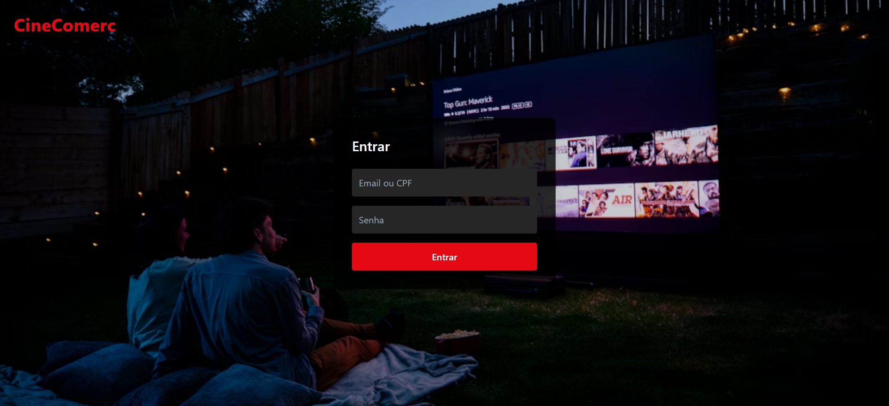
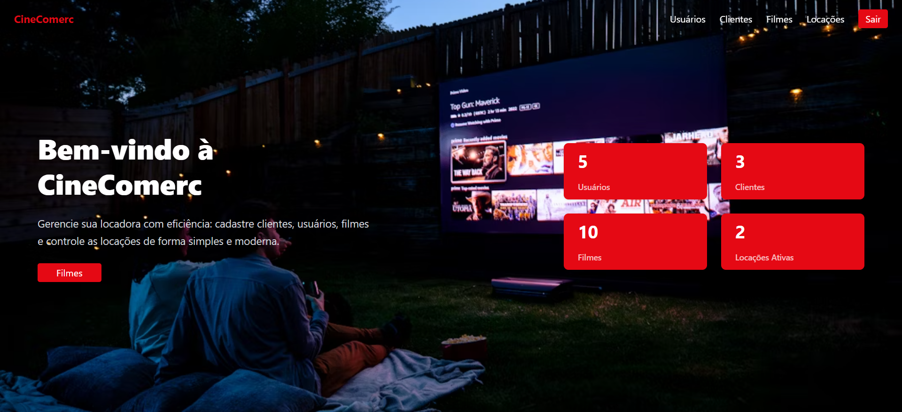
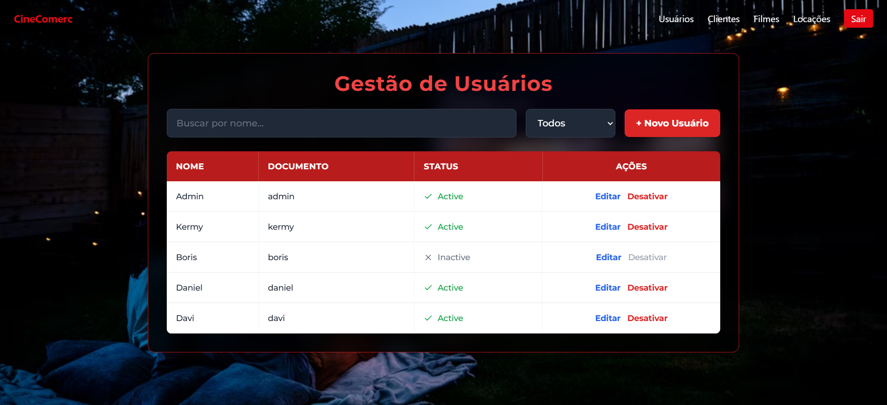
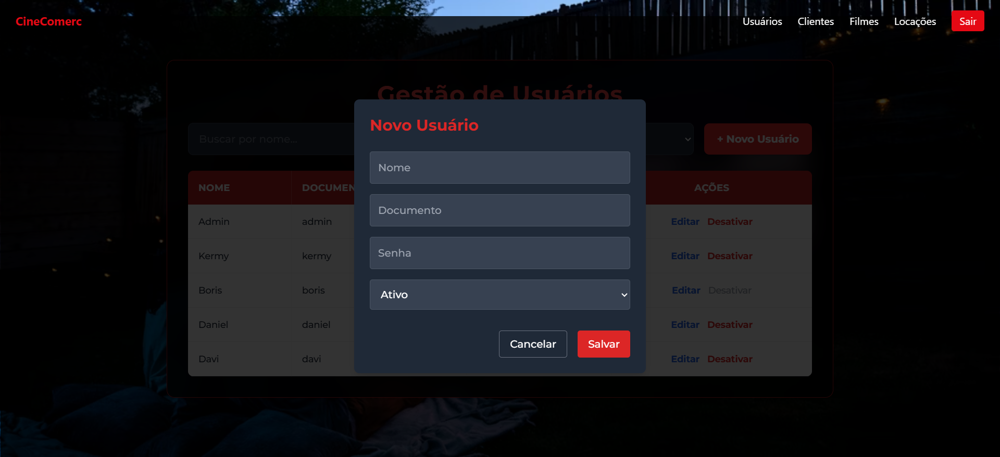
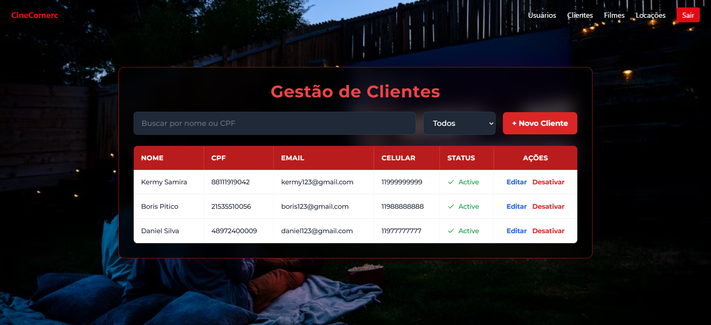
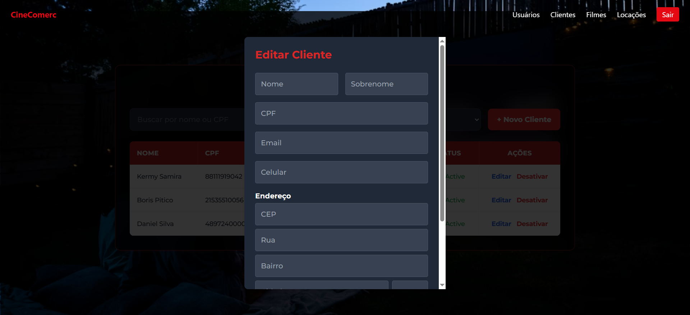
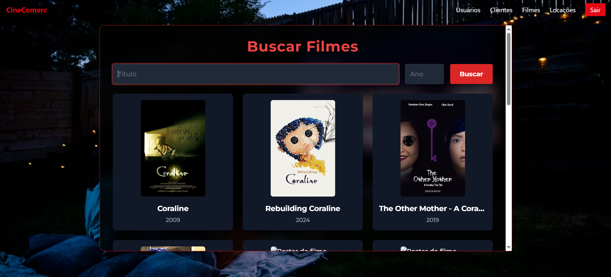
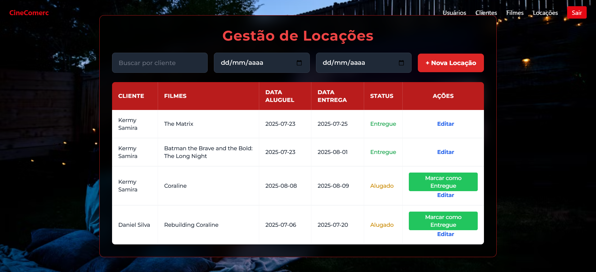

# 🎮 CineComerc — Sistema de Locadora

Aplicativo desenvolvido como parte do **desafio técnico para vaga de Desenvolvedor Front-End na Comerc Energia**, simulando o sistema de gestão de uma locadora. O projeto foi construído com foco em componentização, boas práticas com Vue 3 e organização via Atomic Design.

---

## 📸 Demonstrações Visuais











---

## ✨ Tecnologias Utilizadas

* Vue 3 + TypeScript
* Tailwind CSS *(minha primeira vez usando)*
* Vue Router, Pinia
* OMDb API e ViaCEP API
* Lucide Vue Icons
* Armazenamento local com LocalStorage
* Atomic Design

---

## 📄 Funcionalidades

### 👤 Usuário

* Cadastro, edição, listagem, soft delete
* Login e persistência local
* Bloqueio de login para usuários inativos

### 👥 Clientes

* Cadastro com CEP via ViaCEP API
* Busca por nome e CPF, filtro por status
* Edição e desativação

### 🎥 Filmes

* Busca com OMDb API
* Filtro por ano e nome
* Apenas resultados de tipo "movie"

### 📅 Locações

* Cadastro, validação, listagem
* Bloqueio de locação para cliente com item ativo
* Filtros por cliente, data de locação e entrega

---

## 💪 Como Executar o Projeto

### ✨ IDE Online (StackBlitz)

> Desenvolvi este projeto inteiramente usando **StackBlitz**, pois não possuo computador próprio no momento. Isso dificultou um pouco a produtividade e testagem.

[Abrir projeto no StackBlitz](https://stackblitz.com/github/kermelynsamira-dev/cinecomerc)

### 📂 Rodar localmente (opcional)

```bash
git clone https://github.com/kermelynsamira-dev/cinecomerc.git
cd cinecomerc
npm install
npm run dev
```

### 🔐 Credenciais iniciais

```bash
Login: admin
Senha: 123
```

---

## 🛠️ Estrutura do Projeto

```
├── components/
│   └── layouts/
├── pages/
├── stores/
├── types/
├── utils/
├── public/assets/screenshots/
```

---

## ✅ Requisitos Atendidos

* [x] Cadastro/login/edição de usuários (com soft delete)
* [x] Cadastro, edição e busca de clientes
* [x] Busca de filmes via OMDb com filtros
* [x] Cadastro de locações com regras de negação para clientes ativos
* [x] Armazenamento de tudo no LocalStorage
* [x] Persistência de login e bloqueio de inativos
* [x] Feedback visual em todas as operações
* [x] Componentização em Atomic Design
* [x] Interface responsiva com Tailwind CSS
* [x] Padrão de nomenclatura em inglês (rotas, props, stores)

---

## 🔹 Testes Unitários

> Essa foi minha **primeira experiência com testes** usando **Vitest**. Comecei a estruturar os arquivos, mas **não consegui concluir a implementação dos testes** por limitação de tempo.

```ts
// describe('User Store', () => { ... })
```

Os arquivos estão comentados e servirão de base para implementação futura.

---

## 🛥️ Pontos de Melhoria

Reconheço que o projeto ainda pode ser aprimorado em muitos aspectos:

1. Finalizar e ativar os testes unitários
2. Dockerizar a aplicação para execução simples
3. Implementar paginação nas listagens
4. Criar sistema de autenticação com criptografia
5. Refatorar feedbacks para componente reutilizável
6. Criar tema escuro/claro com toggle
7. Melhorar acessibilidade e navegabilidade
8. Separar stores em camada com serviços externos
9. Adicionar testes end-to-end (Cypress)

---

## 📅 Considerações Finais

Esse foi um projeto desafiador, principalmente por ter sido:

* Minha **primeira vez utilizando Tailwind**
* Minha **primeira experiência estruturando testes**
* Desenvolvido **100% via StackBlitz** por **não ter um notebook próprio**

Apesar dos desafios, me dediquei ao máximo para entregar uma solução funcional, organizada, com boas práticas e foco em qualidade de código.

Estou totalmente aberta a feedbacks e ajustes, pois cada projeto é uma oportunidade de crescimento.

---

## 📢 Contato

**Kermelyn Samira**
📧 [kermelynsamira@gmail.com](mailto:work.ksamira@gmail.com)
🐈 [github.com/kermelynsamira-dev](https://github.com/kermelynsamira-dev)

---

**Obrigada pela oportunidade!**
